<div align="center">




<br/>

[](https://www.linkedin.com/in/amnaarshad05)
[](https://github.com/aamnaarshad)
[](https://github.com/aamnaarshad)

</div>

---

## 🥑 About Me

Hey! I'm **Amna Arshad** — a CS undergrad from **Pakistan 🇵🇰** who likes building things that are equal parts functional and well-designed.

- 🌐 Full-stack: from PHP+MySQL to the whole MERN stack
- 🤖 Trained ML models to detect hate speech using ensemble NLP — check HateGuard!
- 📱 Built a cross-platform Android/iOS app with Flutter before finishing sophomore year
- 🛡️ I think about SQL injection and XSS prevention more than a normal person should
- ☕ Coffee-fuelled, lo-fi-coded, bug-hunting CS student
- 🎯 Currently: learning more · building more · breaking less

---

## 🛠️ Tech Stack

<div align="center">

### 🌐 Frontend


### ⚙️ Backend


### 🗄️ Database


### 🤖 ML · NLP


### 📱 Mobile


### 🔧 Tools


</div>

---

## 📂 My GitHub Projects 🥑

<div align="center">

| 🗂️ Project | 💡 What it does | 🔧 Stack |
|---|---|---|
| [🛡️ CyberSec-Analysis-Agent](https://github.com/aamnaarshad/CyberSec-Analysis-Agent) | Real-time threat monitoring — RBAC, IP blacklisting, alerts | React · Node · Express · MongoDB |
| [⬡ HateGuard](https://github.com/aamnaarshad/HateGuard) | NLP: hate speech vs offensive vs neutral — 3 ML models + majority vote | Python · Flask · scikit-learn · NLTK |
| [⚡ PowerTrack](https://github.com/aamnaarshad/PowerTrack) | Cross-platform electricity meter & bill tracker | Flutter · Dart · Android |
| [🏥 OPD_Connect](https://github.com/aemannadeem62004-sudo/OPD_Connect) | Healthcare OPD platform — OOP PHP, PDO, MySQL, security | PHP · MySQL · Bootstrap5 |
| [🥑 tired-avocado](https://github.com/aamnaarshad/tired-avocado) | just a fun site ;) | HTML · CSS · JS |

</div>

---

## 📊 My GitHub Stats 🥑

<div align="center">

### 🔥 Streak


### 📈 Stats & Languages

&nbsp;


### 📊 Contribution Graph


### 🏆 Trophies


</div>

---

## 🐍 Contribution Snake

<div align="center">


*my commits, getting eaten 🐍🥑*

</div>

---

## 💡 Fun Facts

<div align="center">

```
🥑  the repo is called tired-avocado and i relate to it deeply
🌙  i debug best at midnight with lo-fi playing
🤖  i trained AI to detect hate speech (it works!)
📱  flutter app before sophomore year was done
🛡️  i think about sql injection way too often
☕  coffee is a food group, fight me
```

</div>

---

<div align="center">

### ⚡ Dev Quote


<br/><br/>

*thanks for visiting ✨ star a repo if u like what u see! 🥑*

</div>
